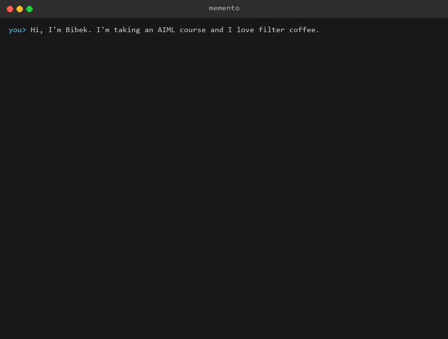

# Memento + MemLayer

[](https://github.com/bibekanandan892/agentice-memory/actions/workflows/ci.yml)
[](#running-the-tests)
[](pyproject.toml)
[](LICENSE)

A personal AI assistant (`memento`) built on a from-scratch, Mem0-style memory library (`memlayer`) — a portfolio implementation of the *"Design Memory for a Personal AI Assistant"* AIML course class, reproducing the classic Mem0 `v0.1.118` two-phase extract/reconcile pipeline entirely from scratch.



*(Real session: actual Gemini replies and real extraction/reconciliation through the full pipeline, rendered to gif by `scripts/record_demo_gif.py --live`. The typed inputs are scripted so the recording is repeatable; everything after each keystroke — the reply, the extracted facts, the `Memory updated ✓` — is live model output.)*

**Design docs (read these first):**
[HLD — system context, read/write path, data architecture](docs/design/01-hld.md) ·
[memlayer LLD — class diagrams, the add() pipeline](docs/design/02-lld-memlayer.md) ·
[memento LLD — CLI, threading model, test doubles](docs/design/03-lld-memento.md)

## What this demonstrates

- **The two-phase memory pipeline**: an extractor LLM call turns a conversation into candidate facts; a reconciler LLM call compares them against existing memories and decides `ADD` / `UPDATE` / `DELETE` / `NONE` — with an anti-hallucination integer-id remap so the model can never invent a plausible-looking memory id.
- **Read path vs write path**: `search()` is synchronous and fast (in-process cosine search); `add()` runs on a background thread *after* the reply is already shown, because the write path is never latency-critical.
- **Two separate stores**: a verbatim chat transcript (`transcript.db`, owned by `memento`) is kept entirely separate from the distilled, searched memory store (`vectors.db`, owned by `memlayer`) — plus a `history.db` audit trail of every mutation.
- **User isolation**: the vector store is sharded by `user_id` — a search physically cannot see another user's rows, not just filtered post-hoc.
- **Semantic / episodic / procedural** categorization of every extracted fact, an extension beyond Mem0's own contract, directly implementing the class notes' memory taxonomy.

## Project layout

```
memlayer/     the memory library — see docs/design/02-lld-memlayer.md
  memory.py       Memory facade + the two-phase add() pipeline
  prompts.py      the frozen extraction/reconciliation LLM prompts
  llms/           LLMBase + GeminiLLM
  embeddings/     EmbeddingBase + SentenceTransformerEmbedder (default) + GeminiEmbedder
  vector_stores/  VectorStoreBase + LocalVectorStore (shard-by-user, SQLite-backed)
  storage/        SQLiteHistoryStore (mutation audit log)

memento/      the CLI assistant — see docs/design/03-lld-memento.md
  assistant.py    read path + threaded write path
  commands.py     /memories /forget /history /user /help /exit
  cli.py          the REPL loop

server/       optional FastAPI wrapper over memlayer.Memory (stretch, see below)
mcp_server/   optional MCP server exposing memlayer as tools (stretch, see below)
scripts/      demo_conversation.py, eval_recall.py, record_demo_gif.py (all support --fake)
tests/        unit + integration (all mocked) + live (needs a real GEMINI_API_KEY)
docs/design/  the frozen HLD/LLD spec — the "paper API" the code implements
docs/media/   generated assets (demo.gif) — see scripts/record_demo_gif.py
```

## Class-notes concept map

| Class notes concept | Where it lives here |
|---|---|
| Short-term vs long-term memory | `TranscriptStore` (session-only, no login needed) vs `memlayer.Memory` (cross-session, requires `user_id`) |
| Semantic / episodic / procedural | `memory_category` on every stored fact (`memlayer/prompts.py`, `memlayer/memory.py`) |
| Read path = personal-scale RAG | `Assistant.chat()`: search → inject top-5 into system prompt → generate |
| Write path: extract → decide | `Memory.add()`: extractor call → reconciler call → apply ADD/UPDATE/DELETE/NONE |
| Never leak memory across users | `LocalVectorStore` shards by `user_id`; `delete_all`/`search`/`get_all` refuse without a scope id |
| Shard by user, no global index | `LocalVectorStore._partitions: dict[user_id -> vectors]` |
| Read latency matters, write doesn't | Search is synchronous; `add()` runs on a background thread |
| Two separate stores | `transcript.db` (raw) vs `vectors.db` (distilled) vs `history.db` (audit) |

Full mapping with file/function references: [`docs/design/01-hld.md` §11](docs/design/01-hld.md#11-class-notes-concept-design-element-mapping).

## Mem0 parity

Targets Mem0's classic `v0.1.118` semantics (current Mem0 `main`/v2 replaced this with a single-call, ADD-only pipeline — research confirmed v0.1.118 is the pedagogically interesting architecture and the one this class actually describes). Full parity table: [`docs/design/02-lld-memlayer.md` §10](docs/design/02-lld-memlayer.md#10-mem0-parity-table). Deliberately out of scope: graph memory, rerankers, telemetry, an async/await twin, expiration/decay.

## Setup (Windows / PowerShell)

```powershell
# Requires Python 3.11+ and uv (https://docs.astral.sh/uv/)
uv sync --extra dev --extra server --extra mcp   # everything needed to run the full test suite
uv sync --extra dev --extra local                 # add this separately for the real local embedder

Copy-Item .env.example .env
# then edit .env and set GEMINI_API_KEY (free key: https://aistudio.google.com/)
```

Without `uv`, a plain `pip install -e ".[dev,server,mcp,local]"` inside a venv works too — the package is a standard `pyproject.toml` project.

The `[local]` extra installs `sentence-transformers` (and `torch`), used for the default embedder. It's optional: the core library and all offline tests never require it (the embedder is lazy-loaded on first real use, so `import memlayer` and the whole test suite work without it). The first time you actually call the real embedder it downloads the `all-MiniLM-L6-v2` model (~90MB) and caches it under your Hugging Face cache dir.

## Running the tests

```powershell
uv run pytest -m "not live" --cov --cov-report=term-missing   # offline suite, no API key needed
uv run ruff check .
uv run pytest -m live          # 1-2 real Gemini calls, needs GEMINI_API_KEY in .env
```

The offline suite (260+ tests) mocks every LLM and, for the default embedder path, mocks `sentence-transformers` too — nothing in CI ever hits the network or downloads a model. `test_server_app.py` and `test_mcp_server_tools.py` need `--extra server`/`--extra mcp` installed (they import `fastapi`/`mcp` at collection time, no skip guard) — that's exactly what CI installs.

## Try it

```powershell
# Scripted, deterministic demo — no API key needed, walks through ADD/UPDATE/DELETE
uv run python scripts/demo_conversation.py --fake

# Retrieval quality check across two users (zero cross-user leakage is a hard gate)
uv run python scripts/eval_recall.py --fake      # deterministic offline smoke test
uv run python scripts/eval_recall.py             # real embeddings, needs --extra local

# The interactive assistant (needs GEMINI_API_KEY in .env)
uv run memento

# Regenerate the README's demo gif (docs/media/demo.gif)
uv sync --extra dev --extra media
uv run python scripts/record_demo_gif.py            # scripted, no API key needed (default)
uv run python scripts/record_demo_gif.py --live      # real Gemini replies, needs --extra local + a key
```

Sample `--fake` demo output (`scripts/demo_conversation.py --fake`):

```
Turn 1 — you: Hi, I'm Bibek, doing an AIML course. My address is 42 MG Road.
  -> ADD: Name is Bibek
  -> ADD: Is doing an AIML course
  -> ADD: Address is 42 MG Road

Turn 2 — you: I love filter coffee.
  -> ADD: Likes filter coffee

Turn 3 — you: Actually, I've switched to green tea instead of coffee.
  -> UPDATE: Drinks green tea instead of coffee

Turn 4 — you: I moved out of 42 MG Road — that address is no longer valid.
  -> DELETE: Address is 42 MG Road

Turn 5 — you: What's 2 + 2?
  -> nothing worth remembering (extraction returned no facts, or all NONE)

=== Final memory state ===
- [semantic] Name is Bibek
- [semantic] Is doing an AIML course
- [semantic] Drinks green tea instead of coffee
```

A sample `uv run memento` session:

```
you> Hi, I'm Bibek. I'm taking an AIML course and I love filter coffee.
memento> Nice to meet you, Bibek! Good luck with the AIML course — and filter coffee is a great choice.
Memory updated ✓

you> /memories
                 Memories for bibek
┏━━━━━━━━━━┳━━━━━━━━━━━━━━━━━━━━━━━━━━━━━┳━━━━━━━━━━━┳━━━━━━━━━━┓
┃ id       ┃ memory                      ┃ category  ┃ created  ┃
┡━━━━━━━━━━╇━━━━━━━━━━━━━━━━━━━━━━━━━━━━━╇━━━━━━━━━━━╇━━━━━━━━━━┩
│ a1b2c3d4 │ Name is Bibek               │ semantic  │ ...      │
│ e5f6g7h8 │ Likes filter coffee         │ semantic  │ ...      │
└──────────┴─────────────────────────────┴───────────┴──────────┘

you> /user alice
Switched to user: alice

you> /memories
No memories yet for alice.

you> /user bibek
Switched to user: bibek

you> /history e5f6g7h8
...event timeline...

you> /forget e5f6g7h8
Memory deleted successfully!

you> /exit
Goodbye!
```

## Optional: REST API server

A minimal FastAPI wrapper (`server/app.py`, stretch Phase 4) exposes the same `memlayer.Memory` instance over HTTP, so a non-Python client — or a future web UI — can use it without embedding the library directly.

```powershell
uv sync --extra dev --extra server --extra local
uv run uvicorn server.app:app --reload
```

Then, from another terminal:

```bash
# Add a memory (infer=false stores it verbatim, no LLM call)
curl -X POST http://127.0.0.1:8000/memories \
  -H "Content-Type: application/json" \
  -d '{"messages": "I love filter coffee", "user_id": "bibek", "infer": false}'

# List everything stored for a user
curl "http://127.0.0.1:8000/memories?user_id=bibek"

# Search
curl -X POST http://127.0.0.1:8000/search \
  -H "Content-Type: application/json" \
  -d '{"query": "what does the user like to drink?", "user_id": "bibek", "limit": 5}'

# History for one memory (use an id from the /memories list above)
curl "http://127.0.0.1:8000/memories/<memory_id>/history"

# Delete
curl -X DELETE "http://127.0.0.1:8000/memories/<memory_id>"
```

Interactive OpenAPI docs are served at `http://127.0.0.1:8000/docs` once the server is running.

> **No authentication.** Every endpoint is open — anyone who can reach the port can read, add, or delete any user's memories. `uvicorn` without `--host` binds to `127.0.0.1` only, so this is fine for local development, but do not deploy this server on a shared network or the public internet without adding an auth layer first.

## Optional: MCP server

`mcp_server/server.py` (stretch Phase 5) exposes memlayer as four MCP tools — `save_memory`, `search_memory`, `list_memories`, `forget_memory` — so any MCP-aware client (Claude Desktop, Claude Code, etc.) can use it directly, over stdio. It reuses the same `Memory` singleton as the REST server (`server/dependencies.py`), so all three surfaces (CLI, REST, MCP) operate on identical data.

```powershell
uv sync --extra dev --extra mcp --extra local
```

Add this to your Claude Desktop config (`%APPDATA%\Claude\claude_desktop_config.json` on Windows):

```json
{
  "mcpServers": {
    "memlayer": {
      "command": "uv",
      "args": [
        "--directory", "C:\\path\\to\\agentice-memory",
        "run", "python", "-m", "mcp_server.server"
      ],
      "env": {
        "GEMINI_API_KEY": "your-key-here"
      }
    }
  }
}
```

Restart Claude Desktop, and the four tools appear in the tool picker. Same authentication caveat as the REST server applies: the server itself has no auth layer — it relies entirely on the MCP client only launching it locally over stdio, never exposing it as a network service.

## Architecture at a glance

See [`docs/design/01-hld.md`](docs/design/01-hld.md) for the full diagram set (system context, component diagram, read/write path sequence diagrams, two-store data architecture, threading model, ER diagrams). Short version:

```
User <-> memento CLI <-> memlayer.Memory <-> {Gemini API, local embedder, SQLite files}
```

Only conversation text and extracted facts ever leave the machine (to Gemini); embeddings, vector search, and all persistence stay local.
