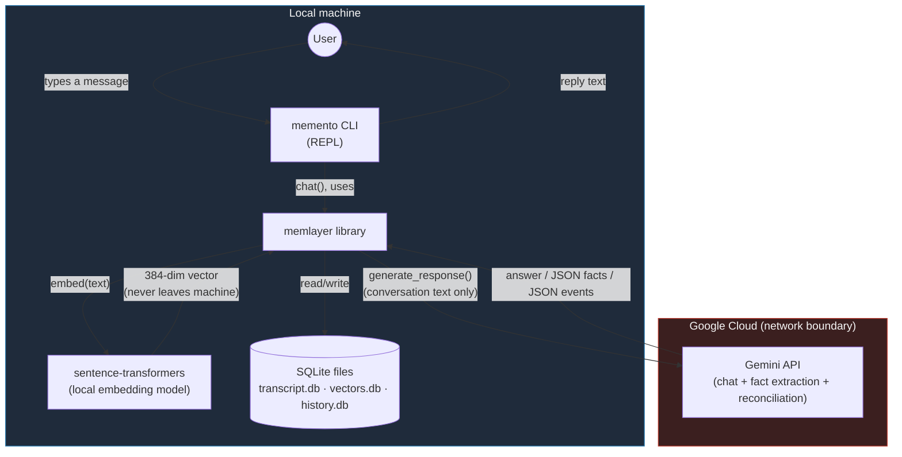
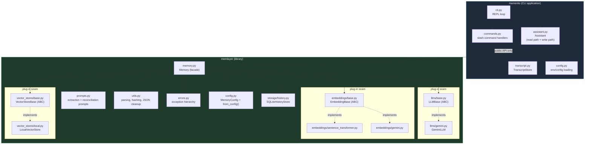
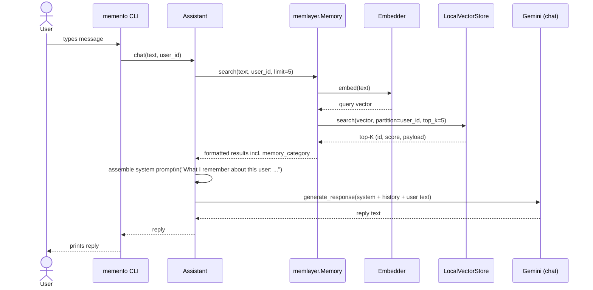
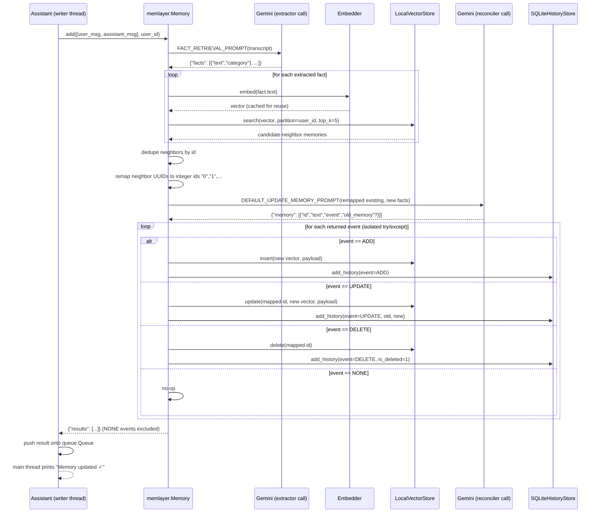
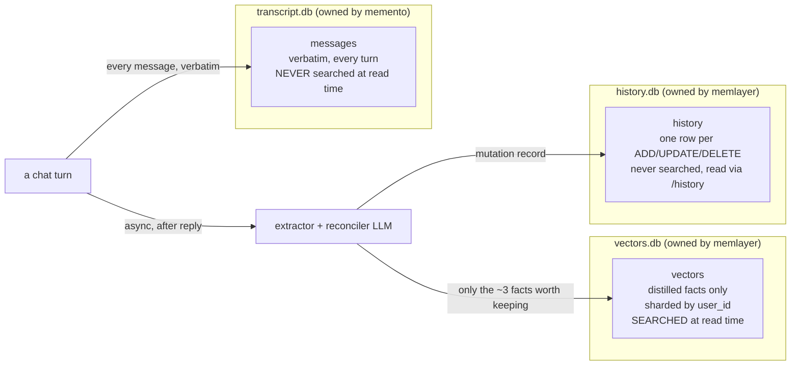
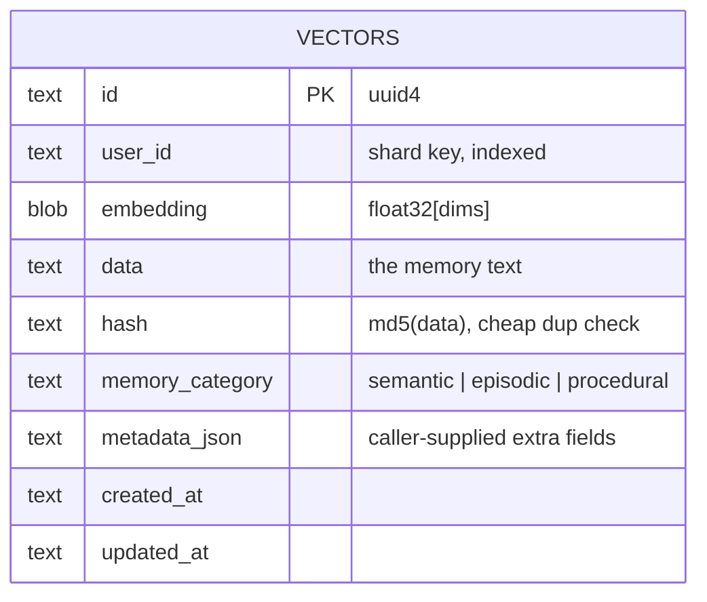
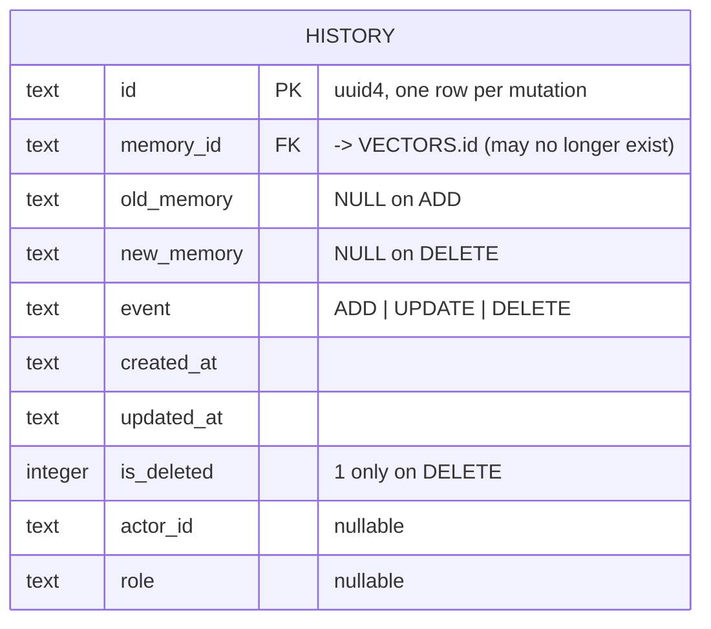
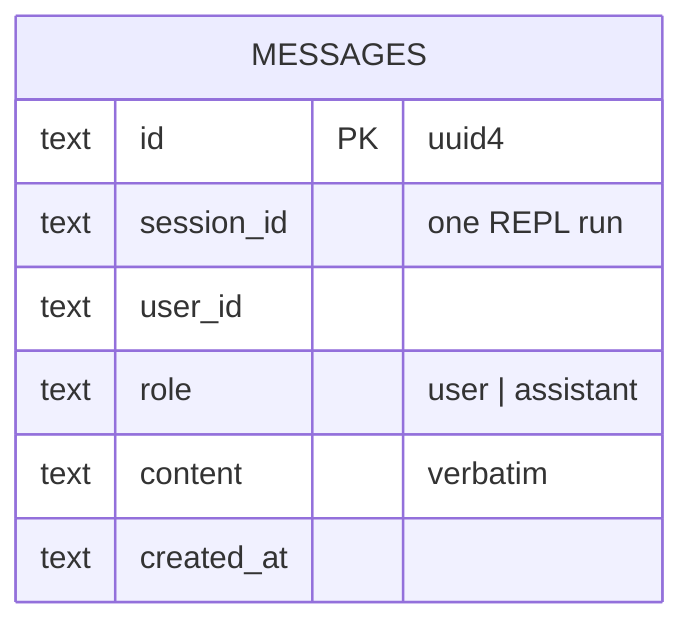
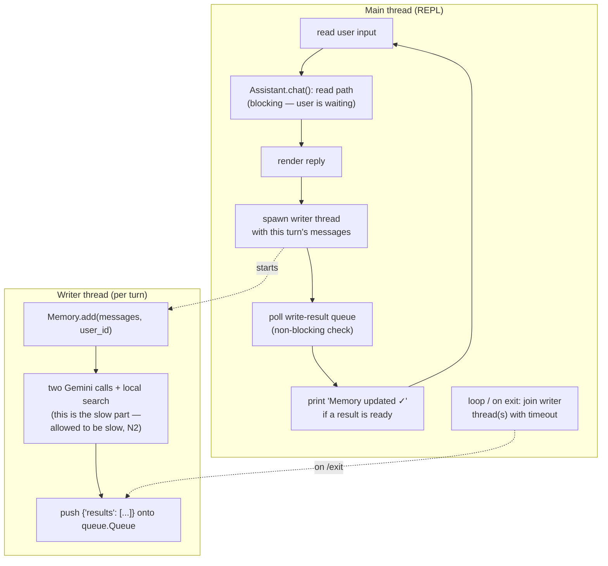

# High-Level Design — Memento + MemLayer

> Portfolio implementation of *"Design Memory for a Personal AI Assistant"* (AIML course, 2026-08-08).
> Status: **design-frozen** — this document is the authoritative spec for Phase 0–3 implementation. Any deviation discovered while coding must update this doc in the same commit.

## 1. Goals & non-goals

### Goals

1. Demonstrate a working, from-scratch implementation of Mem0's classic (`v0.1.118`) two-phase memory pipeline: extract facts → reconcile ADD/UPDATE/DELETE/NONE against existing memories.
2. Demonstrate the class's read-path / write-path split, with the write path running asynchronously off the response-latency critical path.
3. Demonstrate short-term memory (in-session transcript) vs long-term memory (cross-session, vector-searchable, user-scoped) as genuinely separate storage.
4. Demonstrate semantic / episodic / procedural categorization of extracted facts.
5. Demonstrate strict user isolation (memory queries never cross a `user_id` boundary) via a shard-by-user storage layout.
6. Ship as a working CLI product (`memento`) a grader can run in five minutes, plus a reusable library (`memlayer`) a grader can read in isolation.
7. Run entirely on free infrastructure: Gemini API free tier + local embeddings — no paid vector DB, no Docker.

### Non-goals (explicitly out of scope — see class notes §5, out of scope section)

- Graph memory / entity linking (Mem0's `main` branch feature, not `v0.1.118`).
- Rerankers, hybrid BM25 search, multimodal input.
- Memory expiration dates, decay scoring (class notes flag this as "future class" material).
- Multi-agent shared memory, RAG-over-documents (explicitly scoped out of the source class).
- An async/await twin of the library (sync-only, per the approved implementation plan).
- Any paid or hosted vector database — the vector store is a from-scratch NumPy implementation.

## 2. Functional & non-functional requirements

Distilled from class notes §5, mapped onto this specific system.

### Functional

| # | Requirement | Design element |
|---|---|---|
| F1 | Remember relevant information across sessions, not just within one | `memlayer` long-term store (`vectors.db`) survives process restarts |
| F2 | Classify captured facts into semantic / episodic / procedural | Extraction prompt tags each fact; stored as `memory_category` |
| F3 | Retrieve and use memory automatically, at the right moment, without the user asking | `Assistant.chat()` always runs `search()` before answering — never conditional on user phrasing |
| F4 | Handle updates when facts change ("life change" events); keep history rather than silently overwrite | Reconciliation LLM emits `UPDATE`/`DELETE`; every mutation is preserved in `history.db` |
| F5 | Never leak one user's memory into another's context | Every vector-store operation is partitioned and filtered by `user_id`; `delete_all` refuses to run without a scope id |
| F6 | Users can inspect and delete what was saved | `/memories`, `/history`, `/forget` CLI commands |

### Non-functional

| # | Requirement | Design element |
|---|---|---|
| N1 | Read-path latency should stay low relative to the LLM's own baseline (class notes: ~50 ms budget for the memory lookup on top of ~200–500 ms LLM TTFT) | In-process NumPy search over ≤ a few hundred vectors per user (no network hop to a vector DB) |
| N2 | Write path is not latency-critical; must not block the user-visible response | `add()` runs on a background `threading.Thread` after the reply is already rendered |
| N3 | Memory freshness may lag by a turn (async write) — acceptable per class notes | Documented behavior, not a bug: a fact from turn *N* becomes searchable starting turn *N+1* |
| N4 | Deletable on request | `/forget <id>` → `memory.delete()`; `Memory.reset()` for a full wipe |
| N5 | Runs fully offline except LLM calls | Default embedder is local; only `GeminiLLM` and (optionally) `GeminiEmbedder` touch the network |

## 3. System context

What talks to what, and what data crosses the machine boundary. Only conversation text and extracted facts are ever sent to Google's Gemini API; embeddings, vector search, and all persistence stay on-disk, local to the user's machine.

**Trust boundary note:** the only outbound network calls are to the Gemini API (chat completions + JSON-mode extraction/reconciliation, and optionally embeddings if `GeminiEmbedder` is configured instead of the local default). Vector math, storage, and history all happen in-process against local SQLite files.

## 4. Component / package architecture

`memento` and `memlayer` are two independent, separately testable packages. `memento` depends on `memlayer`'s public API only — it never reaches into `memlayer`'s internals. `memlayer` has three explicit plug-in seams (abstract base classes) so a provider can be swapped without touching `Memory` itself.

**Why three seams, not zero:** the point of the exercise (per the class notes' architecture) is that memory is a system with swappable LLM, embedder, and vector-store providers — mirroring how real Mem0 lets you plug in OpenAI vs Gemini vs Ollama, or Qdrant vs Chroma vs pgvector, behind the same `Memory` façade. Only one concrete provider per seam ships in v1 (Gemini LLM, sentence-transformers embedder, local NumPy vector store), but the ABC boundary is real and tested.

## 5. Read path — one chat turn

Mirrors class notes §7. The retrieval step is itself a small, personal-scale form of RAG: instead of searching a document corpus, it searches a per-user fact store.

**Note on N1 (latency budget):** step "M→V→M" never leaves the machine and searches at most one user's partition (bounded to a few hundred vectors in realistic use), so it stays well under the class's ~50 ms memory-lookup budget; the dominant cost is the Gemini chat call itself.

## 6. Write path — two-phase `add()`

Mirrors class notes §8 and Mem0 `v0.1.118`'s reconciliation loop. Runs **after** the reply is already shown to the user, on a background thread — the write path is explicitly not latency-critical (class notes N-requirement: even a 30-minute write delay wouldn't break UX, because short-term memory covers the live session regardless).

**Anti-hallucination note:** the LLM in the reconciler call only ever sees integer-string ids (`"0"`, `"1"`, ...), never real UUIDs — this is the single most important defensive mechanism in the pipeline (see [`02-lld-memlayer.md`](02-lld-memlayer.md) §"Must-not-skip mechanisms").

## 7. Two-store data architecture

The class notes are explicit that **raw chat history** and **intelligent memory** are two different stores (§9): a verbatim audit trail vs a small, distilled, searched set of facts. This project adds a third store — an explicit mutation history — to make the ADD/UPDATE/DELETE/NONE reconciliation auditable, matching Mem0's own `history` table.

This is why the read path never has to re-summarize a growing transcript on every turn: that distillation work already happened once, at write time, and only the small `vectors.db` needs to be searched afterward (class notes §9, closing paragraph).

### Entity-relationship diagrams

## 8. Runtime / threading view

**Failure containment:** if `add()` raises (network error, malformed LLM JSON that survives all repair attempts, etc.), the writer thread catches it, logs a warning, and pushes nothing — the REPL is never affected. See [`03-lld-memento.md`](03-lld-memento.md) for the exact threading contract.

## 9. Technology decisions

| Area | Choice | Rationale |
|---|---|---|
| Language / packaging | Python 3.11+, `uv` | Fast reproducible installs; `pip install -e .` still works for graders without uv |
| Assistant + extractor + reconciler LLM | Gemini API free tier (`gemini-flash-latest` default — the alias tracks Google's current stable flash model, since pinned names get retired server-side; pin via config for reproducibility) | Free tier sufficient for a portfolio demo; JSON mode (`response_mime_type="application/json"`) gives structured extraction/reconciliation output |
| Embeddings (default) | Local `sentence-transformers` `all-MiniLM-L6-v2`, 384-dim | Free, offline, no rate limits on the highest-volume call in the system (once per fact, every turn) |
| Embeddings (optional) | `GeminiEmbedder` behind the same `EmbeddingBase` interface | Proves the abstraction holds with a second real provider |
| Vector store | From-scratch NumPy store, **sharded by `user_id`** | Directly implements the class's scale insight (§6): a query is always scoped to one user, so partition first and only ever search that user's small set — no global ANN index needed |
| Vector persistence | SQLite BLOBs (`vectors.db`) | Atomic writes, compact float32 storage, stdlib-only, Windows-safe (no native build deps) |
| History persistence | SQLite (`history.db`), separate file | Independently swappable from the vector store; mirrors Mem0's own separate history DB |
| Transcript persistence | SQLite (`transcript.db`), owned by `memento` not `memlayer` | Enforces the two-store separation as a structural property, not just a convention |
| CLI | `rich` REPL | Table rendering for `/memories` / `/history`, spinner, and the ChatGPT-style "Memory updated ✓" indicator |

## 10. Scale notes (class notes §6, applied to this project)

The class's back-of-envelope numbers (1M users, 200 memories/user, ~3.3 KB/memory ⇒ ~664 GB, requiring cluster sharding) describe production scale. This project runs single-user, single-machine, with realistically **tens to low hundreds of memories per user** — but the *architectural response* is identical and is what's being demonstrated:

- **Shard by `user_id` first.** `LocalVectorStore` keeps a `dict[user_id → (ids, float32 matrix)]`; a search never scans another user's rows, so lookup cost is O(memories for *this* user), not O(total memories) — the same principle that lets the class's design skip a global ANN index entirely.
- **In-memory for latency.** Partitions are loaded into RAM at startup (class notes: disk-only lookups risk turning a ~50 ms read into 100–200 ms); SQLite is the persistence layer, not the query path.
- **Vector cost dominates storage**, same as the class's math: a 384-dim float32 embedding is 1,536 bytes versus ~50–150 bytes of memory text — consistent with the class's observation that the vector, not the text, is the expensive part of a memory record.

## 11. Class-notes concept → design element mapping

| Class notes concept | Where it lives in this design |
|---|---|
| §1.1 Agent = LLM + Instructions + Tools + **Memory** + Loop | `memlayer.Memory` sits beside, not inside, the Gemini calls in `Assistant` — memory is consulted and updated, never baked into model weights |
| §3 Short-term memory | `TranscriptStore` (`transcript.db`) + the last-N turns kept in the REPL session; no login/user-id required to function |
| §3 Long-term memory, requires identified user | `memlayer.Memory`, always called with a `user_id` |
| §3 Semantic / Episodic / Procedural | Extraction prompt's `category` field → `memory_category` payload key (§7 in [`02-lld-memlayer.md`](02-lld-memlayer.md)) |
| §4 Why not resend everything | `Assistant` injects only the top-5 retrieved facts into the system prompt, never the full transcript |
| §5 Never leak memory across users | Every `VectorStoreBase` method is `user_id`-scoped; `delete_all` refuses to run without a scope id |
| §5 Read latency matters, write latency doesn't | §5/§8 (this doc): read path is synchronous and fast (local search); write path is threaded and allowed to be slow |
| §6 Shard by user ID, no global index | §10 (this doc) and `LocalVectorStore`'s per-user partition dict |
| §7 Read path = a personal-scale RAG | §5 (this doc) |
| §8 Write path: extract → decide (ADD/UPDATE/DELETE/NONE) | §6 (this doc) and the full `add()` LLD in `02-lld-memlayer.md` |
| §8 Decay/forgetting deferred to a future class | Explicitly out of scope (§1, this doc) |
| §9 Two separate stores | §7 (this doc): `transcript.db` vs `vectors.db` |
| §11 Real products (Mem0, HydraDB) | `memlayer` is a from-scratch reimplementation of Mem0 `v0.1.118`'s classic pipeline; see the parity table in `02-lld-memlayer.md` |

## 12. Out-of-scope confirmation

Explicitly not built, and why: graph memory (Mem0's `main` branch replaced the classic pipeline with this — out of scope per research), rerankers/hybrid search (adds complexity without teaching a new memory concept), expiration/decay (class notes defer this to a future session), async/await twin (doubles code for no pedagogical gain in a portfolio project), multi-agent shared memory and RAG-over-documents (both explicitly scoped out of the source class itself).

---
**Next:** [`02-lld-memlayer.md`](02-lld-memlayer.md) — low-level design and class diagrams for the memory library.
