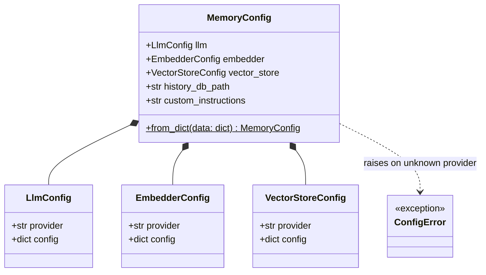
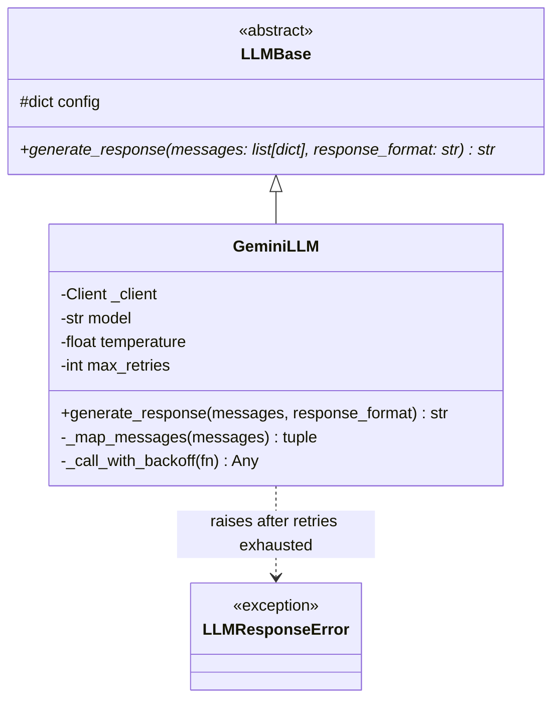
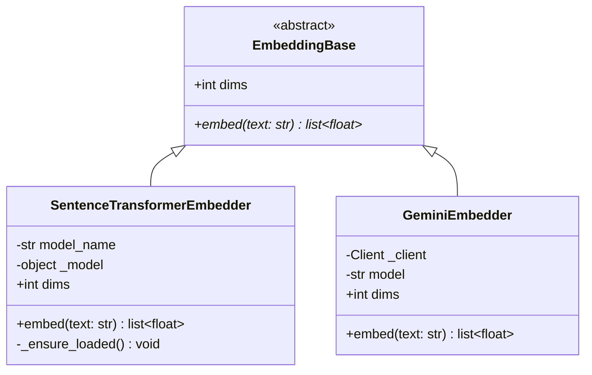
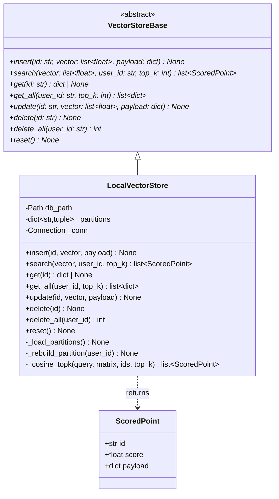
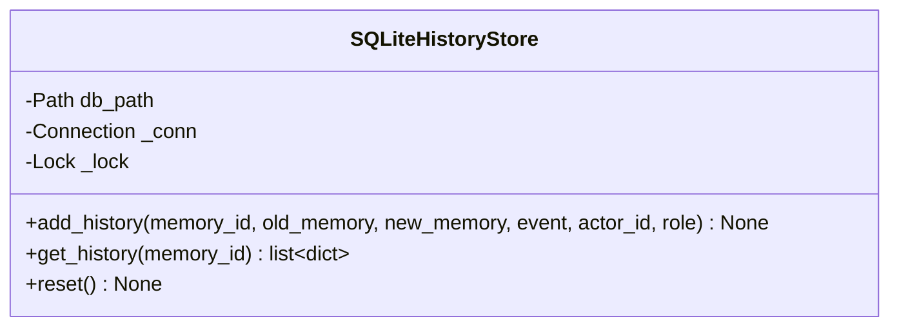
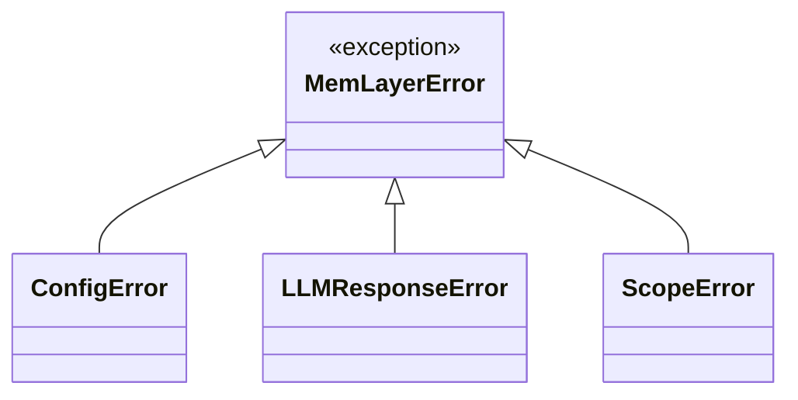
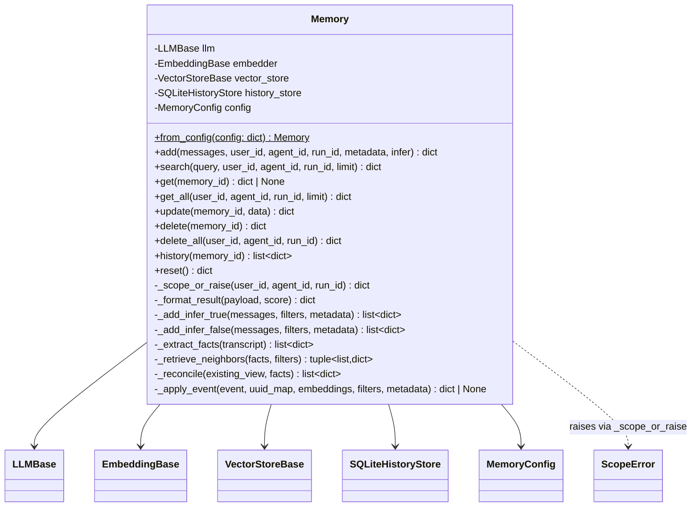
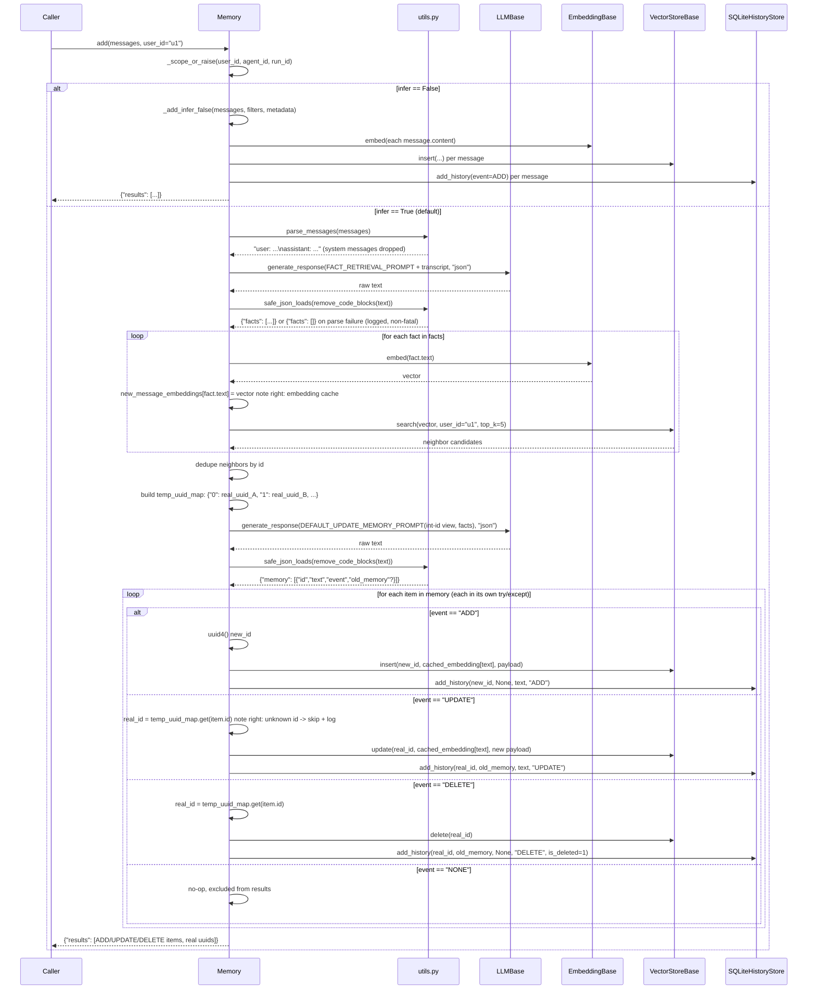
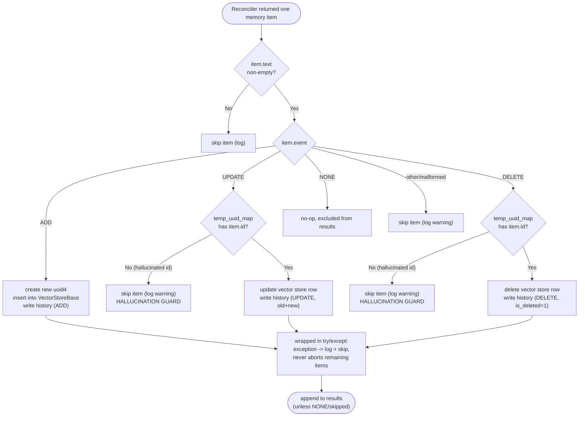

# Low-Level Design — `memlayer`

> Companion to [`01-hld.md`](01-hld.md). This document is the **authoritative class-level spec** for the `memlayer` package: every class, method signature, and sequence here is what Phase 1 implements verbatim. Reproduces Mem0 `v0.1.118` ("classic") semantics per the project's research findings.

## 1. Config classes



**`from_config(dict) → MemoryConfig` behavior:**
- Missing top-level keys fall back to defaults: `llm.provider="gemini"`, `embedder.provider="sentence_transformer"`, `vector_store.provider="local"`, `history_db_path="./data/history.db"`.
- Unknown `provider` string → `ConfigError` with the allowed list in the message (fail fast, per coding-style "fail fast with clear error messages").
- All path fields accept `str` or `pathlib.Path`; normalized to `Path` internally so Windows backslashes round-trip correctly.
- `Memory.from_config(config_dict)` is a thin classmethod: `MemoryConfig.from_dict(config_dict)` → `Memory(config)`.

## 2. LLM provider hierarchy



- `generate_response(messages, response_format="json")` — `messages` is `[{"role": "system"|"user"|"assistant", "content": str}, ...]`; returns the **raw text response** (JSON parsing happens in `memory.py`, not here — keeps the LLM boundary dumb and testable).
- `GeminiLLM._map_messages`: splits the leading `system` message into Gemini's `system_instruction`, the rest into `contents`.
- `GeminiLLM._call_with_backoff`: catches `RESOURCE_EXHAUSTED` / HTTP 429, retries up to `max_retries` (default 3) with exponential backoff + jitter, honoring the server's `retry_delay` field when present; raises `LLMResponseError` once exhausted.
- `response_format="json"` → sets `response_mime_type="application/json"` on the Gemini request (structured-output mode; avoids most fence-wrapping, though `remove_code_blocks` still runs defensively).

## 3. Embedding provider hierarchy



- `SentenceTransformerEmbedder._ensure_loaded()` — lazily imports `sentence_transformers` and constructs the model **on first `.embed()` call**, not in `__init__`. Rationale (HLD §9 + risk mitigation): `import memlayer` must never require `torch` to be installed. Missing the `[local]` extra raises an `ImportError` with the exact fix (`uv sync --extra local`).
- `dims` is a property: `384` for `all-MiniLM-L6-v2`, read from the loaded model for `SentenceTransformerEmbedder`; a fixed constant for `GeminiEmbedder`. `LocalVectorStore` reads `dims` at collection-creation time — this is the mechanism that prevents the "embedder/store dimension mismatch" gotcha called out in the Mem0 research.

## 4. Vector store hierarchy



**`LocalVectorStore` internal structure** (implements HLD §10's shard-by-user design):

```
_partitions: dict[user_id: str, tuple[ids: list[str], matrix: np.ndarray[N, dims], payloads: list[dict]]]
```

- `insert`: appends to the in-RAM partition (creating it if new) **and** writes the row to `vectors.db` in the same call (write-through — no separate flush step, so a crash never loses a committed insert). SQLite `vectors` table stores `embedding` as `np.float32.tobytes()`.
- `search(vector, user_id, top_k)`: **only ever touches `_partitions[user_id]`** — this is the enforced isolation boundary (search literally cannot see another user's rows, not merely filtered post-hoc). L2-normalizes the partition matrix and the query, computes `matrix @ query` for cosine similarity, returns top-K by score descending. Empty/missing partition → `[]`.
- `update` / `delete`: locate the row's index within its user's partition (payload carries `user_id`, so the store knows which partition to touch without being told), mutate the in-RAM matrix/ids/payloads, and rewrite the corresponding SQLite row (`update`) or remove it (`delete`).
- `delete_all(user_id)`: drops the entire partition, returns the count removed (used by `Memory.delete_all` to decide whether to write history rows).
- `_load_partitions()`: called once at construction — reads all rows from `vectors.db` grouped by `user_id` and rebuilds the in-RAM structure. This is what makes `LocalVectorStore(db_path)` from an existing file resume exactly where it left off (the reload-correctness property tested in Task 1.3).
- Score contract (per `VectorStoreBase` docstring, matching the Mem0 research finding): **higher score = more similar**, always in `[-1, 1]` for cosine.

### Implementation notes (Phase 1 Task 1.3 — reconciled deviations)

Discovered while implementing `LocalVectorStore`, not contradicting the design, just filling in unspecified edge cases:
- `insert()` raises `KeyError` with an explicit message if `payload` lacks `"user_id"` (fail fast, per coding-style rules).
- `update(id, ...)` / `delete(id)` raise `KeyError` for an unknown `id` rather than silently no-op-ing — `Memory._apply_event` must catch this per-event (ties into must-not-skip mechanism #4).
- `get()` and `get_all()` both merge `"id"` into the returned payload dict (LLD originally specified this only for `get()`).
- Constructor auto-creates missing parent directories for `db_path` (`mkdir(parents=True, exist_ok=True)`), matching `SQLiteHistoryStore`'s convention.
- Zero-vector inputs are guarded during normalization (division-by-zero → similarity `0.0` instead of `NaN`/crash).

## 5. History store



- Schema (frozen, matches HLD §7 ER diagram exactly):
  ```sql
  CREATE TABLE IF NOT EXISTS history (
      id TEXT PRIMARY KEY,
      memory_id TEXT NOT NULL,
      old_memory TEXT,
      new_memory TEXT,
      event TEXT NOT NULL,
      created_at TEXT NOT NULL,
      updated_at TEXT,
      is_deleted INTEGER NOT NULL DEFAULT 0,
      actor_id TEXT,
      role TEXT
  );
  ```
- `add_history` generates its own row `id` (uuid4) and `created_at` (UTC ISO-8601) internally — callers never pass those.
- `get_history(memory_id)` returns rows ordered `created_at ASC`.
- Thread-safety: a `threading.Lock` guards every write (the writer thread in `memento` and, in principle, concurrent `Memory` instances could otherwise race on the same SQLite file).

## 6. Error hierarchy



| Exception | Raised when | Caller-visible? |
|---|---|---|
| `ConfigError` | `from_config()` sees an unknown provider name or malformed shape | Yes — fails fast at startup, per coding-style rules |
| `LLMResponseError` | `GeminiLLM` exhausts retries | Bubbles out of `Memory.add()`/`search()` — a real infra failure, not swallowed |
| `ScopeError` | `search`, `get_all`, or `delete_all` called with no `user_id`/`agent_id`/`run_id` | Yes — this is the safety rail from HLD F5, not something to silently work around |

**Important distinction — exception vs. graceful degradation** (this is a design decision, not an oversight): a malformed *extraction* JSON response degrades gracefully to `{"facts": []}` with a logged warning (a bad guess about what to remember should never break the chat), but an LLM that's unreachable after retries is a real error the caller should know about. See the error taxonomy table in §9.

## 7. The `Memory` façade



### Public API — exact signatures & return shapes (frozen contract)

| Method | Signature | Returns |
|---|---|---|
| `from_config` | `Memory.from_config(config: dict) -> Memory` | new `Memory` instance |
| `add` | `add(messages: str \| list[dict], *, user_id: str \| None = None, agent_id: str \| None = None, run_id: str \| None = None, metadata: dict \| None = None, infer: bool = True) -> dict` | `{"results": [{"id": str, "memory": str, "event": "ADD"\|"UPDATE"\|"DELETE", "previous_memory"?: str}]}` (`NONE` events are excluded from results, matching Mem0) |
| `search` | `search(query: str, *, user_id=None, agent_id=None, run_id=None, limit: int = 5) -> dict` | `{"results": [{"id","memory","score","user_id",...,"metadata": {...}}]}` |
| `get` | `get(memory_id: str) -> dict \| None` | single formatted result, no `score` key |
| `get_all` | `get_all(*, user_id=None, agent_id=None, run_id=None, limit: int = 100) -> dict` | `{"results": [...]}`, same shape as `search` minus `score` |
| `update` | `update(memory_id: str, data: str) -> dict` | `{"message": "Memory updated successfully!"}` |
| `delete` | `delete(memory_id: str) -> dict` | `{"message": "Memory deleted successfully!"}` |
| `delete_all` | `delete_all(*, user_id=None, agent_id=None, run_id=None) -> dict` | `{"message": "Memories deleted successfully!"}`; **raises `ScopeError`** if no scope id given |
| `history` | `history(memory_id: str) -> list[dict]` | ordered list of history rows (as in §5) |
| `reset` | `reset() -> dict` | `{"message": "All memories reset."}` — clears vector store + history store |

### Payload schema (what actually lands in `LocalVectorStore`)

```json
{
  "data": "the memory text",
  "hash": "md5 of data",
  "memory_category": "semantic | episodic | procedural",
  "created_at": "iso8601 utc",
  "updated_at": "iso8601 utc",
  "user_id": "...",
  "agent_id": "... (optional)",
  "run_id": "... (optional)",
  "...caller_metadata_minus_identity_keys": "..."
}
```

`_scope_or_raise` also **strips** `user_id`/`agent_id`/`run_id` out of any caller-supplied `metadata` dict before merging — identity is immutable after creation and can never be smuggled in through metadata (must-not-skip mechanism #5, HLD §6 note).

`_format_result` promotes `user_id`/`agent_id`/`run_id` to top-level result keys and nests everything else (including `memory_category`) under a `"metadata"` key on read — except `memory_category`, which is promoted alongside the identity keys since the class-notes categorization is a first-class concept in this project, not an incidental metadata field. *(Design decision, documented here as a deliberate deviation from strict Mem0 parity — flagged again in the README parity table.)*

## 8. The two-phase `add()` pipeline — detailed sequence

This is the centerpiece of the whole project (HLD §6, expanded to method-level detail).



### Must-not-skip mechanisms — mapped to this diagram

| # | Mechanism | Where in the sequence above |
|---|---|---|
| 1 | UUID → integer-string remapping before the reconciler sees existing memories | `build temp_uuid_map` step, before the second `LLM` call |
| 2 | Per-fact embedding cache, reused at write time (never re-embed) | `new_message_embeddings[fact.text] = vector`, read again in every `ADD`/`UPDATE` branch |
| 3 | `remove_code_blocks()` + `safe_json_loads()` before any `json.loads` | Both `Utils` calls, after every LLM response |
| 4 | Per-event isolation — one bad event never aborts the batch | "each in its own try/except" note on the final loop |
| 5 | Identity-key stripping from caller metadata | `_scope_or_raise` (§7), invoked before any payload is built |
| 6 | History row on **every** mutation, including each `delete_all` row | `Hist.add_history` call inside every `ADD`/`UPDATE`/`DELETE` branch |

### Event-application flowchart (decision detail, incl. failure paths)



## 9. Error taxonomy

| Condition | Behavior | Rationale |
|---|---|---|
| Extraction call returns unparseable JSON | Graceful degradation → `facts = []`, warning logged, `add()` still returns `{"results": []}` | A guessing failure about *what* to remember should never crash the chat |
| Reconciliation call returns unparseable JSON | Same — `{"results": []}`, warning logged | Same rationale; nothing was committed, safe to no-op |
| Reconciliation references an id not in `temp_uuid_map` | That single item is skipped (hallucination guard), rest of the batch still applies | Isolates model hallucination to one fact, not the whole turn |
| One event's vector-store/history write raises (e.g. disk error) | That item is skipped, exception logged, remaining events still processed | Must-not-skip mechanism #4 |
| `GeminiLLM` exhausts retries (network/quota) | `LLMResponseError` propagates out of `add()`/`search()` | A real infrastructure failure — the caller (memento) must know, not silently continue |
| `search`/`get_all`/`delete_all` called with no scope id | `ScopeError` raised immediately, before touching any store | Safety rail (HLD F5) — must be a hard failure, never a silent "search everything" fallback |
| `from_config()` given an unknown provider | `ConfigError` at construction time | Fail fast (coding-style rule), never at first use |

## 10. Mem0 parity table

| Mem0 `v0.1.118` behavior | This project |
|---|---|
| Two-phase extract → reconcile pipeline | Reproduced exactly (§8) |
| `ADD/UPDATE/DELETE/NONE` events | Reproduced exactly |
| UUID→int remap anti-hallucination trick | Reproduced exactly (must-not-skip #1) |
| `infer=False` verbatim path | Reproduced (§8, `_add_infer_false`) |
| Payload `data`/`hash`/`created_at`/`updated_at` keys | Reproduced exactly |
| History table schema | Reproduced exactly (§5) |
| Graph memory, rerankers, telemetry, async twin | **Not implemented** — frozen out-of-scope (HLD §1) |
| `memory_category` (semantic/episodic/procedural) tagging | **Added** — not in Mem0; implements class-notes §3 directly. Promoted to top-level in read results (§7), a deliberate parity deviation |

---
**Next:** [`03-lld-memento.md`](03-lld-memento.md) — low-level design and class diagrams for the CLI application and test harness.
