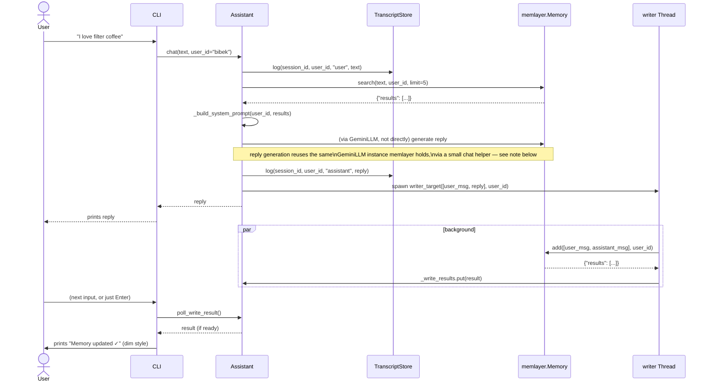
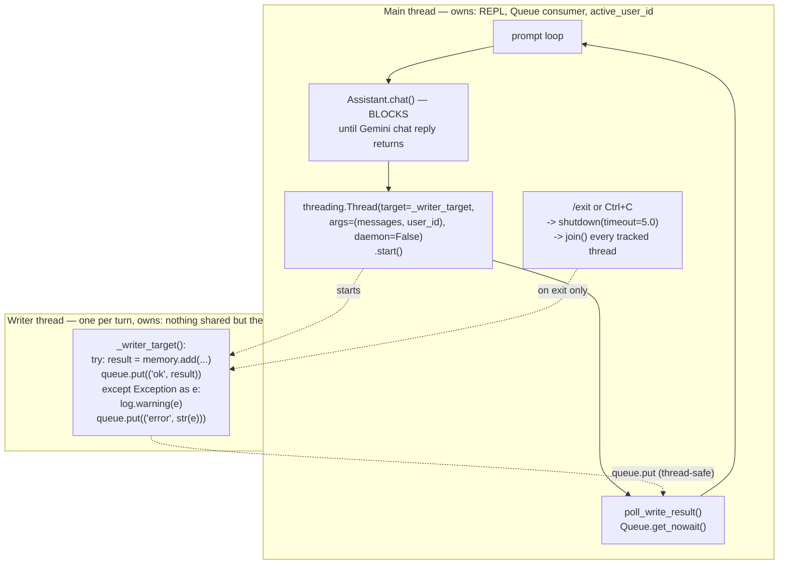
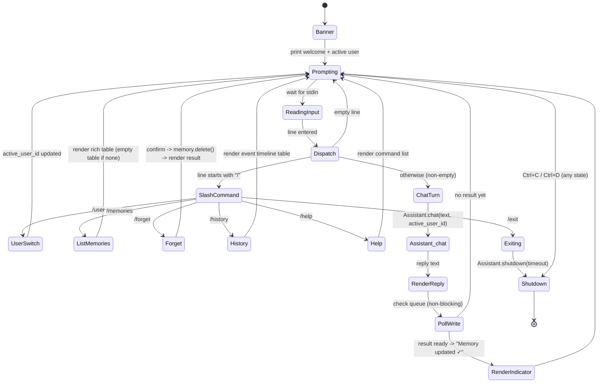
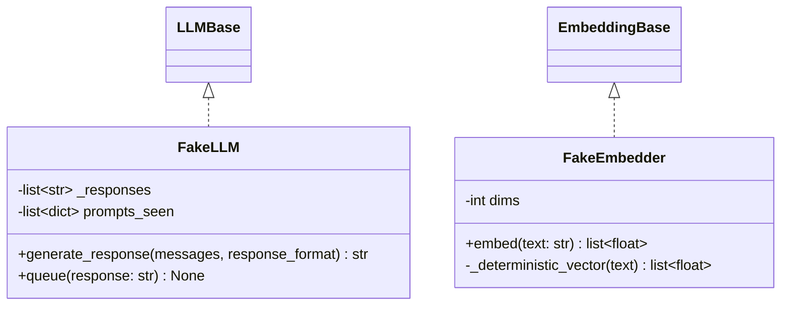

# Low-Level Design — `memento` (CLI app) + test harness

> Companion to [`01-hld.md`](01-hld.md) and [`02-lld-memlayer.md`](02-lld-memlayer.md). Covers the application that consumes `memlayer`, and the fakes every test in the project depends on.

## 1. Class diagram — application

```mermaid
classDiagram
    class AppConfig {
        +str gemini_api_key
        +Path data_dir
        +Path transcript_db_path
        +Path vectors_db_path
        +Path history_db_path
        +str default_user_id
        +load_from_env() AppConfig$
        +to_memlayer_config() dict
    }
    class TranscriptStore {
        -Path db_path
        -Connection _conn
        +log(session_id, user_id, role, content) None
        +recent(user_id, n) list~dict~
        +reset() None
    }
    class Assistant {
        -Memory memory
        -TranscriptStore transcript
        -str session_id
        -Queue _write_results
        -list~Thread~ _pending_writers
        +chat(text, user_id) str
        +poll_write_result() dict | None
        +shutdown(timeout) None
        -_build_system_prompt(user_id, retrieved) str
        -_spawn_writer(user_msg, reply, user_id) None
        -_writer_target(messages, user_id) None
    }
    class CommandRegistry {
        -dict~str,Callable~ _handlers
        +register(name, handler) None
        +dispatch(line, context) CommandResult
    }
    class CommandResult {
        +bool handled
        +str | Table render
        +bool should_exit
    }
    class CLI {
        -AppConfig config
        -Assistant assistant
        -CommandRegistry commands
        -str active_user_id
        +run() None
        -_render_reply(text) None
        -_render_memory_indicator(result) None
        -_prompt_loop() None
    }

    AppConfig ..> Assistant : builds memlayer config for
    Assistant --> TranscriptStore
    Assistant --> "memlayer.Memory" : uses public API only
    CLI --> Assistant
    CLI --> CommandRegistry
    CommandRegistry ..> CommandResult
```

### Method contracts

| Class.method | Contract |
|---|---|
| `AppConfig.load_from_env()` | Reads `.env` via `python-dotenv`; missing `GEMINI_API_KEY` → prints a friendly one-line fix (`Set GEMINI_API_KEY in .env — get one free at aistudio.google.com`) and exits with code 1, **not** a stack trace |
| `AppConfig.to_memlayer_config()` | Returns the `dict` shape `Memory.from_config()` expects (HLD §9 tech choices baked in as defaults) |
| `TranscriptStore.log(session_id, user_id, role, content)` | Appends one row to `transcript.db`; never raises on the hot path — a transcript-write failure is logged, never surfaced to the user |
| `TranscriptStore.recent(user_id, n=6)` | Last *n* messages for this user across the current session, oldest-first, for inclusion in the read-path prompt |
| `Assistant.chat(text, user_id)` | **Synchronous** — blocks until the reply is ready (this is the read path; see §2). Internally logs both turns to `TranscriptStore`, then spawns the write-path thread before returning |
| `Assistant.poll_write_result()` | Non-blocking `Queue.get_nowait()`; returns `None` if no write has completed since the last poll, else the `add()` result dict |
| `Assistant.shutdown(timeout=5.0)` | Joins any still-running writer threads with a timeout; called from `/exit` and on Ctrl+C |
| `CommandRegistry.dispatch(line, context)` | `line` starts with `/`; unknown command → `CommandResult(handled=True, render="Unknown command. Try /help")`; `context` carries the active `Assistant`/`user_id` so handlers can call `memory.get_all()`, `memory.delete()`, etc. |

## 2. Chat-turn sequence (end-to-end)

Expands HLD §5 (read path) and §6/§8 (write path) into the exact call sequence inside `memento`.



**Note on the chat-generation call:** `Assistant` does not duplicate LLM plumbing — it reuses a lightweight `GeminiLLM.generate_response()` call (the same class `memlayer` uses internally) constructed from `AppConfig`, kept as a private `Assistant._chat_llm` field, distinct from the `Memory` instance's internal extractor/reconciler use of `GeminiLLM`. Both point at the same Gemini API key and model but are logically separate calls (matching the class notes' point that "the assistant LLM and the extractor LLM can be entirely different models" — here they happen to be the same provider, but architecturally decoupled).

## 3. Threading model (detailed contract)

Expands HLD §8.



**Invariants (must hold, tested in Task 2.2/2.3):**
1. `Assistant.chat()` never blocks on the writer thread — it returns as soon as the chat reply is ready, always before the write-path work is guaranteed done.
2. A writer-thread exception is **caught inside the thread function itself** and turned into a queued `("error", msg)` tuple — an uncaught exception in a `Thread` is silently swallowed by Python by default, which would make write failures invisible; this project makes them visible via the queue instead.
3. `queue.Queue` is the only cross-thread shared state — no shared mutable dict/list is touched from both threads (avoids needing a lock in `Assistant` itself; `SQLiteHistoryStore`/`LocalVectorStore` bring their own internal locking per `02-lld-memlayer.md`).
4. `shutdown(timeout)` is called on **every** exit path (`/exit` command, Ctrl+C via `KeyboardInterrupt`, EOF via `Ctrl+D`) so the last turn's memory write isn't silently dropped when the user quits immediately after chatting.
5. SQLite connections used from the writer thread are either opened per-call or created with `check_same_thread=False` guarded by the stores' internal locks (decided and implemented in `LocalVectorStore`/`SQLiteHistoryStore`, `02-lld-memlayer.md` §4–5) — `Assistant` itself holds no raw DB connections.

## 4. REPL state diagram



## 5. Slash commands — handler contract

| Command | Args | Behavior |
|---|---|---|
| `/memories` | none | `memory.get_all(user_id=active_user_id)` → rich `Table` with columns: short-id (first 8 chars), memory text, category, created_at. Empty → "No memories yet for this user." |
| `/forget <id-or-prefix>` | id prefix | Resolve against `get_all()` results; ambiguous prefix → list candidates and abort; unique match → confirm-then-`memory.delete(id)` → prints resulting `{"message": ...}` |
| `/history <id-or-prefix>` | id prefix | Same resolution as `/forget`; `memory.history(id)` → table of `event, old_memory, new_memory, created_at` |
| `/user <name>` | name | Sets `active_user_id`; demonstrates isolation live — a fresh `/memories` immediately after shows a different (or empty) set |
| `/help` | none | Lists all commands with one-line descriptions |
| `/exit` | none | `Assistant.shutdown()` then breaks the prompt loop |

Short-id resolution logic is shared code (`commands.py::_resolve_id(prefix, candidates)`) used by both `/forget` and `/history` — one implementation, not two copies (DRY per coding-style rules).

## 6. Prompt-assembly template (read path, exact format)

```
SYSTEM:
You are Memento, a helpful personal assistant with memory of past conversations.
Answer naturally using the facts below when relevant. Do not mention "memory" or
"database" mechanics to the user — just use the facts as things you already know.

What I remember about this user:
- {memory_1.memory}  ({memory_1.metadata.memory_category})
- {memory_2.memory}  ({memory_2.metadata.memory_category})
...(top-5 from search(), omitted entirely if results are empty — no empty header)

Recent conversation:
{last N turns from TranscriptStore.recent(), "role: content" per line}
```

- If `search()` returns zero results (new user, nothing learned yet), the "What I remember" block is **omitted entirely**, not left as an empty header — an empty section reads worse than no section (reviewed detail from Task 2.2).
- `N` (recent-turns count) defaults to 6, matching the class notes' example session size (§6 back-of-envelope math: "6 user messages + 6 assistant replies per session").

## 7. Test-double class diagram (used by every test in the project)



- **`FakeLLM`**: constructed with (or fed via `.queue()`) an ordered list of canned response strings; each `generate_response()` call pops the next one and records the full prompt it was given (so tests can assert *what* was sent, e.g. "the reconciler prompt contained integer ids, never a UUID"). Popping past the end raises a clear `AssertionError` ("test provided fewer FakeLLM responses than were consumed") rather than a confusing `IndexError`.
- **`FakeEmbedder`**: `dims=8` by default (small, fast); `_deterministic_vector(text)` seeds `numpy.random.default_rng(int(hashlib.md5(text.encode()).hexdigest(), 16) % 2**32)` so **identical text always produces an identical vector** and different text produces different (effectively orthogonal-enough) vectors — this makes cosine-similarity assertions in tests reproducible without downloading a real model.

### Testing-strategy map (LLD class → test file, from the approved implementation plan)

| LLD class | Test file |
|---|---|
| `MemoryConfig`, `LlmConfig`, `EmbedderConfig`, `VectorStoreConfig` | `tests/unit/test_config.py` |
| `remove_code_blocks`, `safe_json_loads`, `parse_messages` (utils) | `tests/unit/test_utils.py` |
| `FACT_RETRIEVAL_PROMPT`, `DEFAULT_UPDATE_MEMORY_PROMPT` builders | `tests/unit/test_prompts.py` |
| `LocalVectorStore` | `tests/unit/test_vector_store_local.py` |
| `SQLiteHistoryStore` | `tests/unit/test_history_store.py` |
| `SentenceTransformerEmbedder`, `GeminiEmbedder` | `tests/unit/test_embeddings.py` |
| `GeminiLLM` | `tests/unit/test_gemini_llm.py` |
| `Memory` read APIs (`search`/`get`/`get_all`/`history`) | `tests/unit/test_memory_read_api.py` |
| `Memory.add()` two-phase pipeline | `tests/unit/test_memory_add.py` (unit, FakeLLM/FakeEmbedder) + `tests/integration/test_add_search_roundtrip.py` (integration, real SQLite in `tmp_path`) |
| `Memory.update/delete/delete_all/reset` | `tests/unit/test_memory_mutations.py` |
| `AppConfig`, `TranscriptStore` | `tests/unit/test_transcript.py` |
| `Assistant` (read path, write path, threading contract) | `tests/unit/test_assistant.py` |
| `CommandRegistry` + handlers | `tests/unit/test_commands.py` |
| Full REPL session | `tests/integration/test_cli_session.py` (scripted stdin) |
| Real Gemini API (1–2 calls only) | `tests/live/test_live_smoke.py`, `@pytest.mark.live`, skipped without `GEMINI_API_KEY` |

---
**This completes the design phase.** Implementation (Phase 0 → Phase 3 of the approved plan) proceeds using these three documents as the frozen spec. Any signature or behavior change discovered while coding updates the relevant doc in the same commit as the code change.
